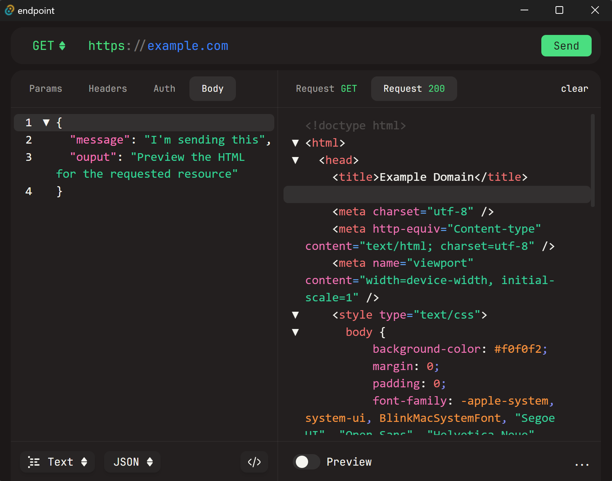

# endpoint

`!!! WORK IN PROGRESS !!!`

Endpoint is a simple HTTP client for testing APIs. It dosent provide (yet) any persitence or history, but it does provide an easy and fast way to test an endpoint.

## Tech stack

- Rust
- Vue.js
- TailwindCSS

## No realease yet

As the project is still in development, there is no release yet. But you can clone the repo and run it locally.

## How to run

You need to have Rust and Node.js installed. After cloning the repo, run the following commands:

```bash
# Install dependencies
npm install

# Start the app in development mode
npm run tauri dev
```

## Current preview



Currently the output panel is not yet finished, but the request panel and actually sending the request works fine.

You can also preview the html response in the browser by clicking the "Preview" button.

## TODO

The UI is actually preatty much a clone of Httpie, but I plan to change it in the future (maybe when shadcn-vue release the split pane component).

- [ ] Request options

  - [x] Method
  - [x] URL
  - [x] Headers
  - [x] Body
  - [x] Auth
  - [x] Query params
  - [x] Form data
  - [x] Files
  - [ ] Cookies
  - [ ] Timeout
  - [ ] Follow redirects
  - [ ] Proxy
  - [ ] Verify SSL
  - [ ] Certificate
  - [ ] Custom CA bundle
  - [ ] Ignore host
  - [ ] Output options

- [ ] Output options
  - [ ] Headers
  - [ ] Body
  - [ ] Cookies
  - [ ] Status code
  - [ ] Timing
  - [ ] Response time
  - [ ] Request time
  - [ ] Request size
  - [ ] Response size
  - [ ] Response headers
  - [ ] Response body
  - [ ] Response raw
  - [ ] Response pretty
  - [ ] Response JSON
  - [ ] Response XML
  - [ ] Response YAML
  - [x] Response HTML
  - [x] Response preview for HTML
- [ ] Persist requests
- [ ] Collection of requests
- [ ] History
- [ ] Environments
- [ ] Tests
- [ ] Settings
